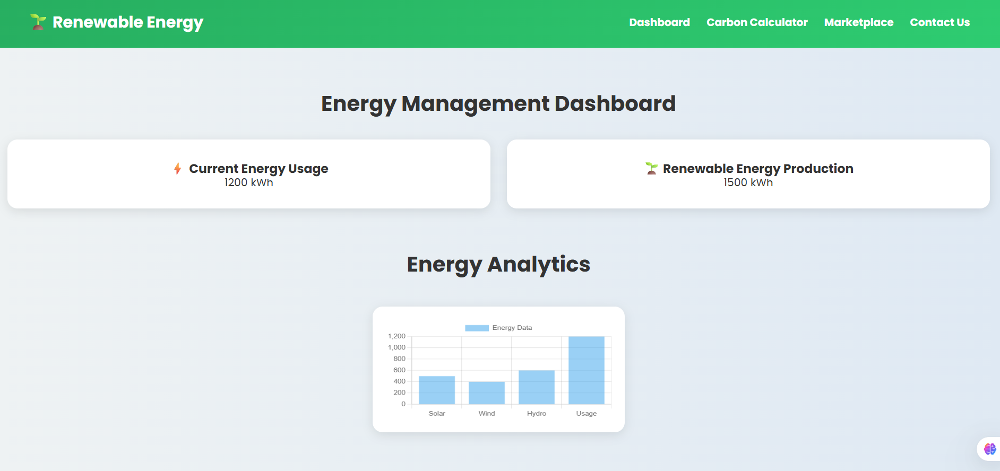
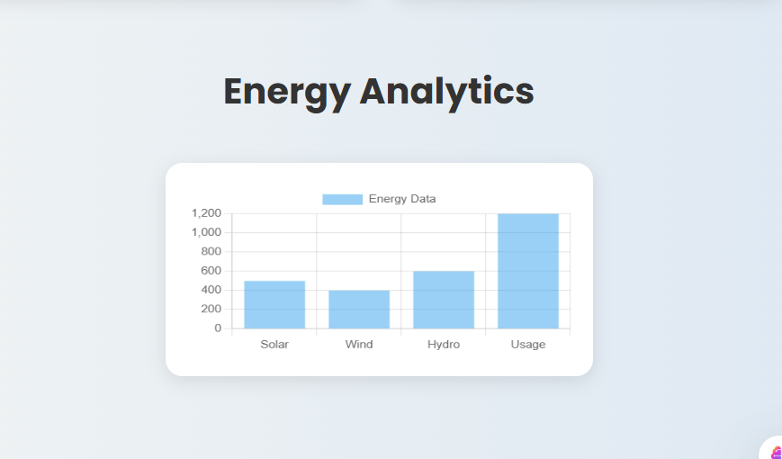
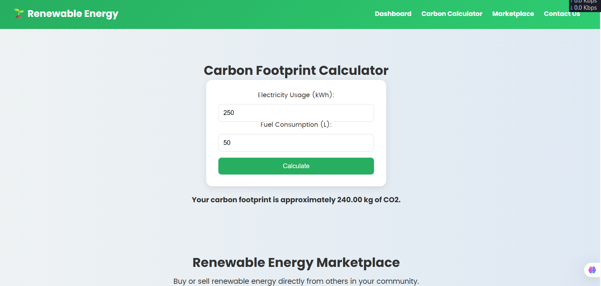
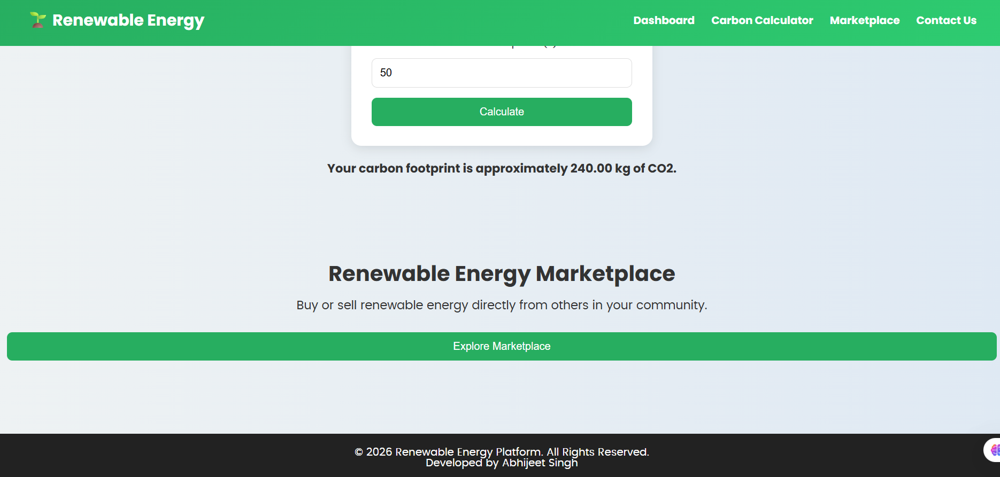

# Renewable-HIT 🌱⚡

## 📌 Overview
Renewable-HIT is a web-based Renewable Energy Management Platform designed to promote sustainable energy awareness. The platform allows users to monitor energy usage, track renewable energy production, and calculate their estimated carbon footprint through an interactive dashboard.

---

## ✨ Features
- Renewable energy dashboard
- Energy usage monitoring
- Renewable energy production tracking
- Carbon footprint calculator
- Interactive marketplace section
- Responsive and modern UI

---

## 🛠️ Tech Stack

### Frontend
- HTML5
- CSS3
- JavaScript
- Chart.js

---

## ⚙️ Functionality
- Displays energy consumption and renewable energy production data
- Calculates estimated carbon emissions
- Interactive dashboard with analytics chart
- Marketplace section for future renewable energy trading

---

## 📸 Screenshots

### Homepage


### Energy Analytics


### Carbon Calculator


### Marketplace


---

## 📂 Project Structure

```bash
Renewable-HIT/
│
├── screenshots/
│   ├── analytics.png
│   ├── calculator.png
│   ├── homepage.png
│   └── marketplace.png
│
├── index.html
├── styles.css
├── scripts.js
└── README.md
```

---

## 🚀 How to Run

1. Clone the repository

```bash
git clone https://github.com/imaabhijeet/Renewable-HIT.git
```

2. Open the project folder

3. Run `index.html` using Live Server in VS Code

---

## 🎯 Objective
The objective of this project is to encourage sustainable energy awareness and provide users with tools to monitor energy usage and estimate environmental impact.

---

## 🚀 Future Improvements
- Real-time API integration
- User authentication
- IoT sensor integration
- Advanced analytics dashboard
- Renewable energy trading system

---

## 👨‍💻 Developer
- Abhijeet Singh

---

## ⭐ Support
If you found this project useful, consider giving it a star on GitHub!